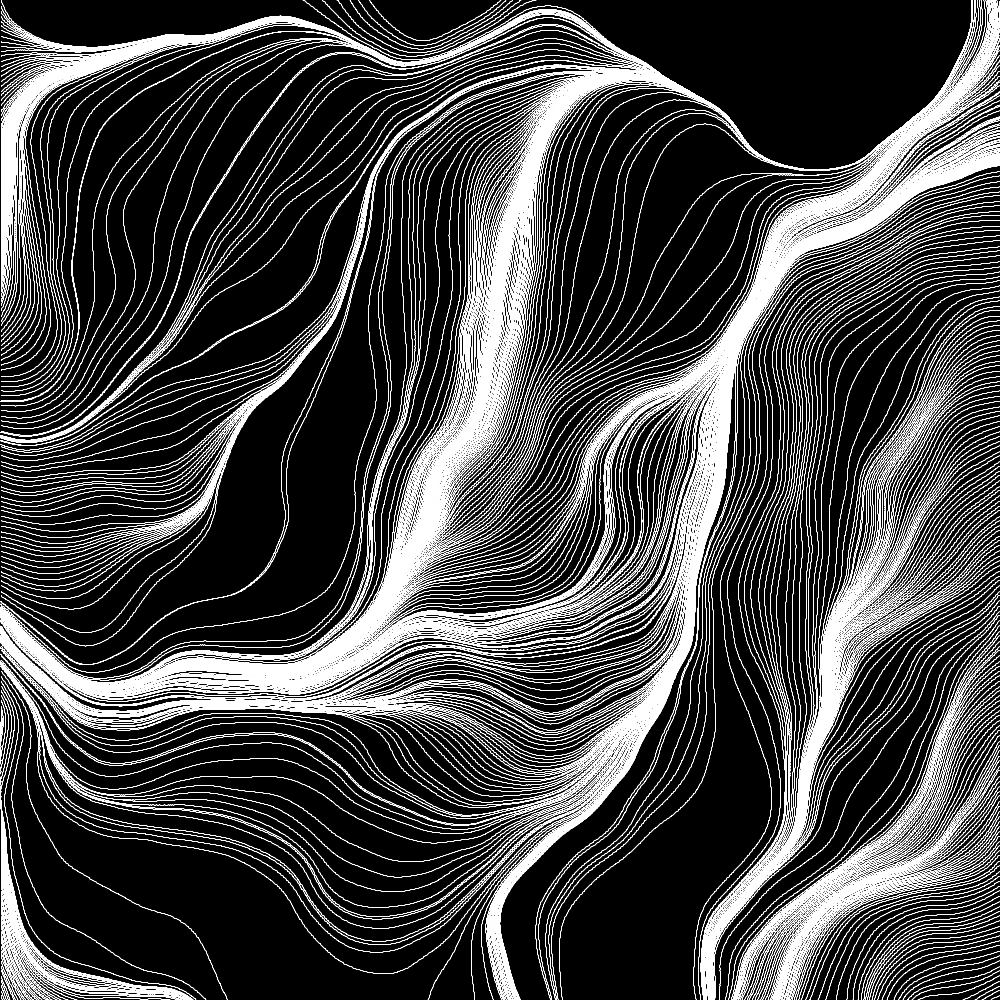

P3Drawings
=======================

 
 Introduction
 ------------
 
The collection of folders in this repository are different projects experimenting with computer generated art, built for the Processing 3 environment. Each folder houses a different project's sketch file.
 
Using the Program
-----------------

*__First, download the directories for the projects you would like to implement.__*
    
*__To start a sketch, right click on the .pde or .pyde file in the directory of the desired project, then select 'Open with Processing'.__*

*__Feel free to tweak the values of different parameters and see how they impact the sketch!__*

Contribution
----------
 
- __Issue Tracker:__ https://github.com/nobo428/P3Drawings/issues
- __Source Code:__ https://github.com/nobo428/P3Drawings
 
Support / Troubleshooting
-------
 
If you are having issues, please let me know!
*Email me at:* nbbodin4@gmail.com
